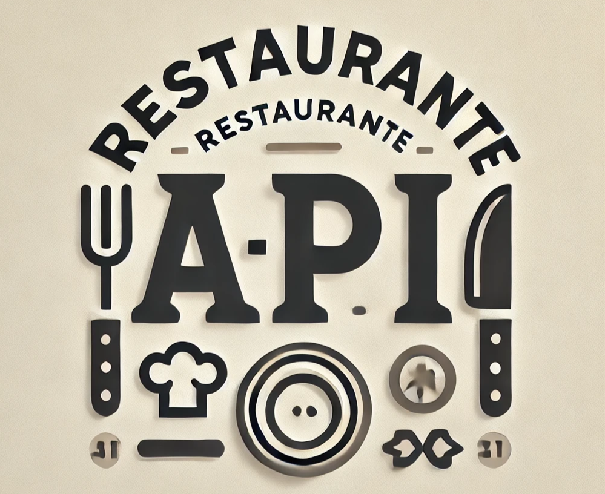

# Prueba tecnica: Restaurante



Esta es una API REST para la gestión de un restaurante, que contiene las funcionalidades CRUD para platos, ingredientes, órdenes, mesas y usuarios. La API permite gestionar dinámicamente las tareas del restaurante, incluyendo el registro de diferentes usuarios con roles específicos (mesero, administrador), garantizando una administración eficiente de las operaciones.
La API utiliza Spring Boot, y JWT para la autenticacion.

---
## Características

- **Gestión de Ingredientes**: Permite registrar, listar, actualizar y obtener ingredientes por su ID.
- **Gestión de Mesas**: Administra la creación, actualización y cambio de estado de las mesas, así como la asignación de órdenes a mesas.
- **Gestión de Órdenes**: Funcionalidades CRUD para la gestión de órdenes de los clientes.
- **Gestión de Platos**: Registrar, listar, actualizar y obtener platos por su ID.
- **Gestión de Usuarios y Roles**: Registro de meseros y administradores, con roles asignados.
- **Autenticación**: Login mediante bearer token para autenticar usuarios en el sistema.
---
## Requisitos

- **Java 17+**
- **Spring Boot 3+**
- **Maven**
- **Base de datos relacional (MySQL, PostgreSQL, etc.)**
- **JWT**
---
## Instalación

1. Clona el repositorio.

```
 git clone <https://github.com/OpiumnJei/Api_Restaurante>
 cd <nombre-del-proyecto>
```
---
## Documentación de Endpoints

## Ingredientes

### Listar Ingrediente por ID
- **GET** `/restaurante/ingredientes/{id}`
- **Descripción**: Obtiene los detalles de un ingrediente por su ID.

### Listar Todos los Ingredientes
- **GET** `/restaurante/ingredientes`
- **Descripción**: Lista todos los ingredientes registrados.

### Registrar un Ingrediente
- **POST** `/restaurante/ingredientes`
- **Descripción**: Permite registrar un nuevo ingrediente en el sistema.

### Actualizar Ingrediente
- **PUT** `/restaurante/ingredientes/{id}`
- **Descripción**: Actualiza los datos de un ingrediente existente.

---
## Mesas

### Listar Mesa por ID
- **GET** `/restaurante/mesas/{id}`
- **Descripción**: Obtiene los detalles de una mesa específica por su ID.

### Listar Todas las Mesas
- **GET** `/restaurante/mesas`
- **Descripción**: Lista todas las mesas registradas.

### Registrar una Mesa
- **POST** `/restaurante/mesas`
- **Descripción**: Permite registrar una nueva mesa en el restaurante.

### Actualizar Mesa
- **PUT** `/restaurante/mesas/{id}`
- **Descripción**: Actualiza los datos de una mesa existente.

### Cambiar Estado de una Mesa
- **PUT** `/restaurante/mesas/estado-mesa/{id}`
- **Descripción**: Cambia el estado de una mesa (disponible, ocupada, reservada).

### Listar Órdenes en Proceso por Mesa
- **GET** `/restaurante/mesas/ordenes/{idMesa}`
- **Descripción**: Obtiene la orden en proceso para una mesa específica.

---
## Órdenes

### Listar Orden por ID
- **GET** `/restaurante/ordenes/{id}`
- **Descripción**: Obtiene los detalles de una orden específica por su ID.

### Listar Todas las Órdenes
- **GET** `/restaurante/ordenes`
- **Descripción**: Lista todas las órdenes registradas.

### Registrar una Orden
- **POST** `/restaurante/ordenes`
- **Descripción**: Permite registrar una nueva orden.

### Actualizar Orden
- **PUT** `/restaurante/ordenes/{id}`
- **Descripción**: Actualiza los datos de una orden existente.

### Eliminar Orden
- **DELETE** `/restaurante/ordenes/{id}`
- **Descripción**: Elimina una orden existente.

---
## Platos

### Listar Plato por ID
- **GET** `/restaurante/platos/{id}`
- **Descripción**: Obtiene los detalles de un plato específico por su ID.

### Listar Todos los Platos
- **GET** `/restaurante/platos`
- **Descripción**: Lista todos los platos disponibles.

### Registrar un Plato
- **POST** `/restaurante/platos`
- **Descripción**: Permite registrar un nuevo plato en el restaurante.

### Actualizar Plato
- **PUT** `/restaurante/platos/{id}`
- **Descripción**: Actualiza los datos de un plato existente.

---
## Usuarios y Roles

### Registrar Mesero
- **POST** `/restaurante/registro-usuarios/mesero`
- **Descripción**: Registra un nuevo mesero en el sistema.

### Registrar Administrador
- **POST** `/restaurante/registro-usuarios/administrador`
- **Descripción**: Registra un nuevo administrador en el sistema.

---
## Autenticación

### Login
- **POST** `/restaurante/login`
- **Descripción**: Autentica a un usuario y genera un token JWT para acceder a los demás endpoints.

---
## Autorización
Los endpoints de la API están protegidos mediante **JWT** (JSON Web Tokens). Para acceder a la mayoría de los recursos, debes estar autenticado y proporcionar un token válido en los **headers** de las solicitudes.


